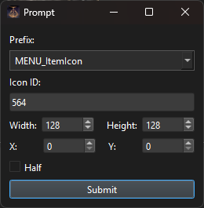
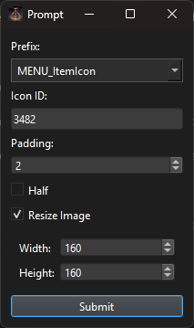

# Adding Custom Textures

## Important:
This process is primarily for games that use layout systems, aka Sekiro, Elden Ring, Nightreign, and Armored Core 6.  
If you want to add a new icon to an old game such as Dark Souls 1 or 3, disable `Hide Blank Icons` in [Settings](settings.md) and replace the blank slot using the guide [Replacing Textures](replacing.md). If there are no blank slots, use the Append feature, but ensure your icon matches the required grid pattern for the atlas.
Creating icons for Dark Souls 2 is much simpler. See [Creating a Custom File](customfiles.md).

## Getting Started:
If you want to add your own atlas, click the "+" button on the bottom right of the atlas list. (Fig. 1 in [Introduction](introduction.md))
You will be prompted for the atlas' name, and if you want a `Blank Image`. If the checkbox is ticked, an empty image of the specified dimensions will be created. If it is left disabled, you will be prompted for an image from your computer. You can then add or define custom icons by following this guide.

To start adding your icons to an atlas (vanilla or your own), click the "+" button on the bottom right of the subtexture list. (Fig. 2 in [Introduction](introduction.md))
You will be given 2 options:

### Define:

This will add a SubTexture entry to the layout from an existing section of the atlas.

Every subtexture has a name that is formatted as `{prefix}_{icon id}`. Generally, the prefix should be "MENU_ItemIcon", but some common ones are included in the dropdown box, and a custom one can be written too. The Icon ID you choose is what you will use in Smithbox or elsewhere to implement the icon. It should be a UIn16, and DSTS will warn you if it isn't.

Width, Height, X, and Y are self explanatory. These are the coordinates and dimensions of your icon.

There's also a checkbox labeled "half". I actually have no idea what this is used for lmao. Still, it's a flag in every SubTexture element, so it's possible to choose its value for yourself.

After filling out the subtexture's info, you will be prompted for an image on your computer. png or dds is recommended but any PIL compatible format should work.

### Append:

This option is for if you want to add your own icon/image to the current atlas.

The name is done in the same way as Defining, you probably want "MENU_ItemIcon_{icon id}".

The padding field dictates how many empty pixels will be placed between your icon and the existing ones. Default=2

Still don't know what 'half' does :)

Checking `Resize Image` flags DSTS to scale your image down to a given width and height using LANCZOS. I would recommend just using an input image of the correct dimensions, but this may be helpful regardless.

After filling out the subtexture's info, you will be prompted for an image on your computer. png or dds is recommended but any PIL compatible format should work.

### Notes:
 - Icon #0 in Dark Souls generally corresponds to the "Empty Icon" that's used if nothing is held in that slot. For this reason, you probably want to avoid modifying it if you're trying to add a custom icon.
