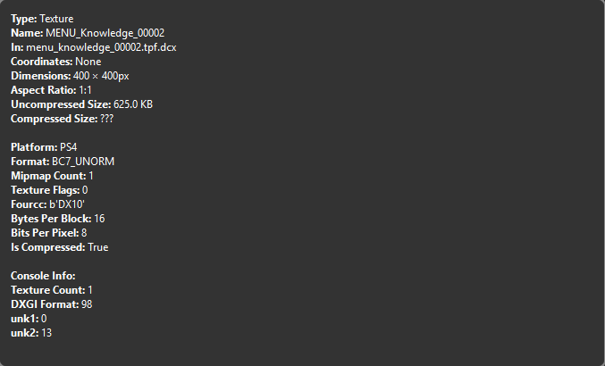
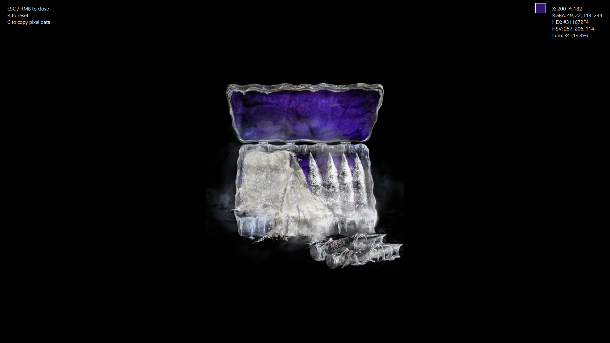

# Other Application Features

### Expanded Texture Info Window

  
Accessed by double clicking the Texture Info Box. (Fig. 4 in [Introduction](introduction.md))  

### Fullscreen Texture Viewer

  
Accessed by double clicking the Texture Preview. (Fig. 3 in [Introduction](introduction.md))  