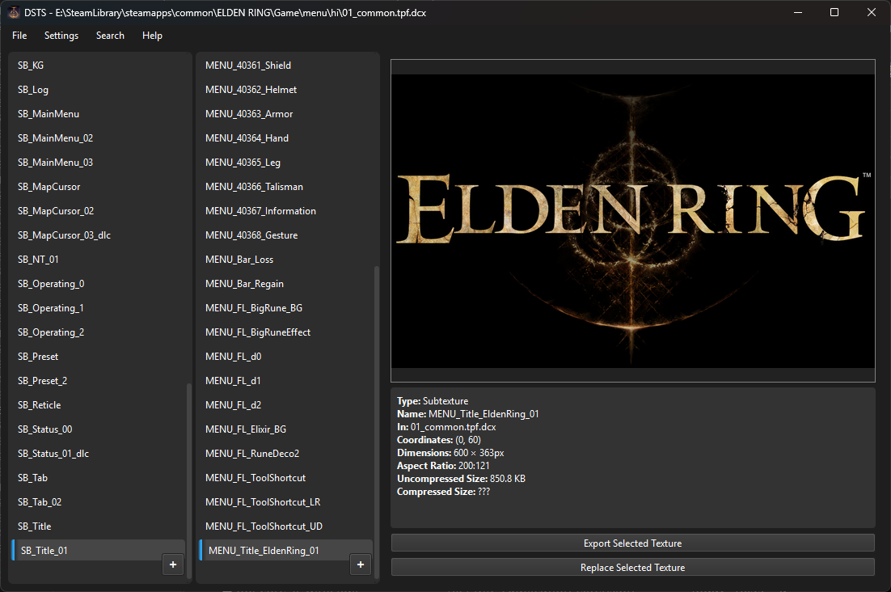

#  Dark Souls Texture Studio

Welcome to the documentation.

This graphical application allows you to:

- Load and preview texture files from their binders. No Witchy needed!  

- View useful texture data  

- Export textures and icons  

- Replace textures and icons  

- Create/define new icons  

- Write custom tpf files with optional DCX compression  

Use the navigation menu to learn more.