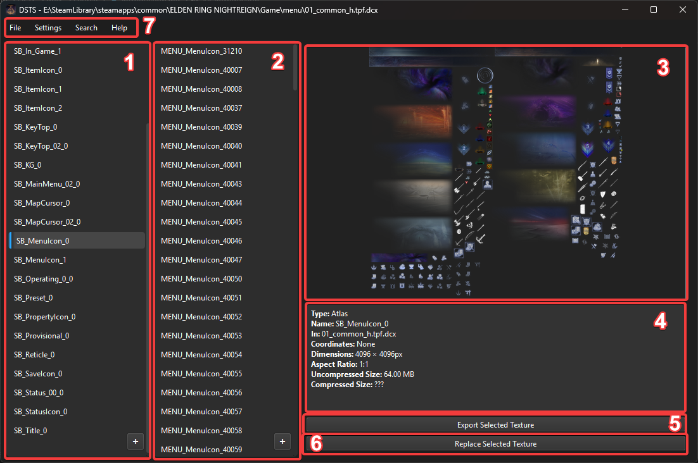
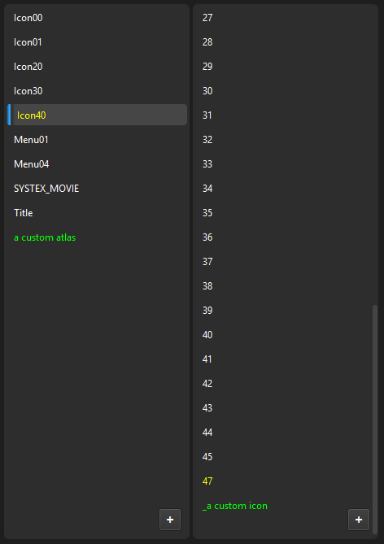

# Introduction

1. Atlas list - This where your atlases and textures go. Think of atlases as big images containing smaller icons that the game can crop from during play.
2. Subtexture list - If DSTS succeeds in loading layout data, you will be able to see subtextures here. This is not a representation of any internal files, but rather DSTS crops the 'parent' atlas you have selected to a set of coordinates and dimensions. For modern games this data comes from an sblytbnd.dcx file. For older games I have defined uniform atlases in [GameInfo.py](https://github.com/dash512/DarkSoulsTextureStudio/blob/main/DSTextureStudio/GameInfo.py)
3. Texture preview - Self explanatory. Shows a preview of the currently selected texture, where that be an atlas or one of its subtextures. TIP: double click me! (See: [Features](features.md))
4. Texture info - A small window that displays information and data for the texture currently loaded in the preview. TIP: double click me! (See: [Features](features.md))
5. Export button - Exports the currently loaded texture. If you have an atlas selected, you can choose to select the entire image, or all of its subtextures. Allows both png and dds output.
6. Replace button - Replaces the selected texture with an image from your computer.

## Menu Bar (fig. 7):
 - File:
    - Open File - Prompts for a texture file (.tpf/.tpf.dcx) to load.
    - Open Directory - Loads all aforementioned files in a given folder.
    - Apply Changes - Initilizes writing of modified or custom files. Prompts for an output directory.
    - Dump - Allows you to export ALL atlases or ALL subtextures (to a folder named after their parent atlas).
    - Clear - Resets the interface and unloads any files.
    - Exit - Take a guess.
 - Settings:
    Application settings. See [Settings](settings.md) for more info.
 - Search:
    Prompts the user for a string. By default it searches through the current subtexture list using Qt.MatchContains. Tick "Search Atlases" to, you guessed it, search through atlases instead.
 - Help:
    Contains some random info including links to this documentation.
    Also has `Console` which allows you to interact with the application, inspect data, and execute python code. See [Console](console.md)

## List entries
  
Changes are highlighted within DSTS lists. Green for custom, and Yellow for modified. (See image)
Right clicking these entries in the application will open a context menu. (See "Context Menu")

## Context Menu
If an atlas is replaced, the only option will be `revert`, which, predictably, reverts the atlas to its vanilla form.
If a custom atlas is added, you will have options to `delete` or `rename` the atlas. I believe these are self explanatory.

The exact same logic applies to modified subtextures, too.